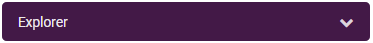
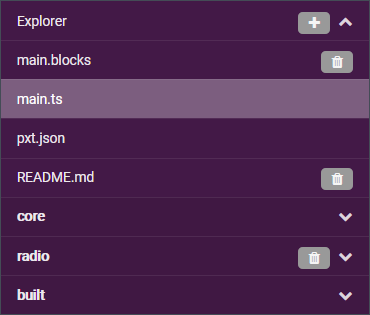
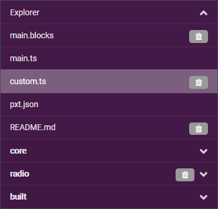

# BioWearables_Workshop_BL

Custom blocks and examples for the BioWearables workshop, using Brilliant Labs' b.Board 1.1, and their new MakeCode IDE.

[[_TOC_]]

----

## Using the MakeCode IDE

#### Getting started

There are advantages to using **Chrome** as a browser, particularly for debugging and flashing programs to the micro:bit more seamlessly (see [below](#recommended-browser)).

The Brilliant Labs IDE for the new b.Board (v1.1) is at [code.brilliantlabs.ca](https://code.brilliantlabs.ca).

Make sure to use the link above and not the older IDE at [~~bboard.now.sh~~](https://bboard.now.sh/) which was developed for the first version of the b.Board (v1.0). The new IDE should have three `Advanced` libraries called `BBoard_Mic`, `BBoard_Motor` and `BBoard_Music`.

----

#### Storing and retrieving projects

From the initial page you can create or import projects. To store and retrieve them, you can:

- Use the built-in browser system (stored locally in the browser history).
- Import hex files.
- Import repositories from Github.
- Cut and paste TypeScript files into the JavaScript editor.

The built-in system works fine, but there is no versioning and everything is lost if you erase your browser history.

Hex files can contain both libraries for custom blocks and a main program. They are convenient as single items that can be directly imported to setup a project. This repository has examples available in the [./hex/](./hex/) folder.

The IDE also features GitHub integration, for instance to commit changes directly to a remote repository. But since we are working on GitLab I have not used the functionality much.

Finally, TypeScript files can be copied directly into the JavaScript editor. This repository has examples available in the [./typescript/](./typescript/) folder.

- Switch to `JavaScript` view in an existing project.

- Open the `Explorer` on the side.

- Click `+` to add `Add custom blocks`.

- You should see a new `custom.ts` file which can be used for libraries.

- You can now copy code for a library into `custom.ts`.
- And code for a program goes into `main.ts`.
- Switching back to `Blocks` view renders the program into blocks.

----

#### Running a program on the micro:bit

From the IDE you can save your project to your computer as a hex file. You can then transfer that file to the micro:bit over USB. This process can be shortened somewhat by pressing `Download` and then right clicking to `Save Link As` directly to the micro:bit. It remains a multi-step process though.

This can be simplified to a single click of the `Download` button if you do the following:

- Run the MakeCode IDE in **Chrome**.
- Use a recent version of the micro:bit **firmware** (see [below](#updating-the-microbit-firmware)).
- **Pair** the micro:bit (see [below](#pairing-a-microbit)).

Instead of the regular `Download` button:

You should now see the following which allows you to flash the micro:bit directly:

----

#### Updating the micro:bit firmware

Instructions and up to date versions of the firmware are available [here](https://microbit.org/get-started/user-guide/firmware/).

----

#### Pairing a micro:bit

There are extensive instructions on how to pair a micro:bit [here](https://makecode.microbit.org/v0/reference/bluetooth/bluetooth-pairing).

In Chrome however, and with the micro:bit plugged in through USB, it was a simple process launched by clicking on the three dots on the side of the `Download` button.
