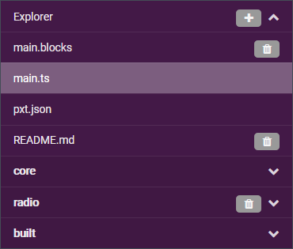
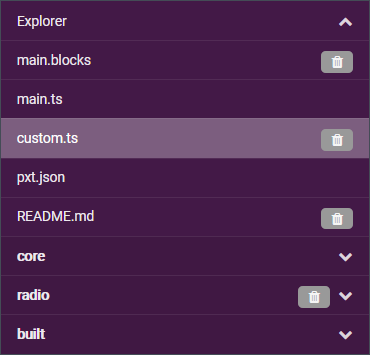
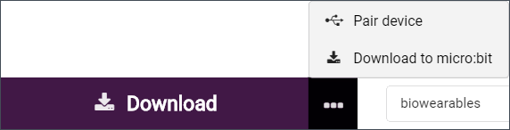
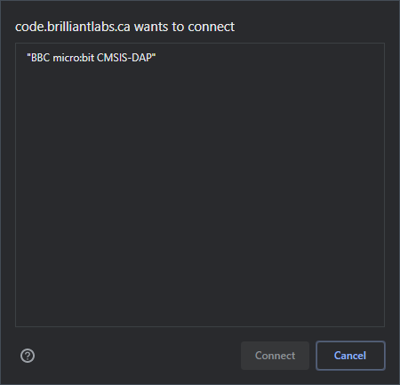

# Using the MakeCode IDE

### Contents

- [Getting started](#getting-started)
- [Storing and retrieving projects](#storing-and-retrieving-projects)
- [Copying TypeScript files into projects](#copying-typescript-files-into-projects)
- [Running a program on the micro:bit](#running-a-program-on-the-microbit)
- [Efficient setup](#efficient-setup)
- [Updating the micro:bit firmware](#updating-the-microbit-firmware)
- [Pairing a micro:bit](#pairing-a-microbit)

----

### Getting started

There are advantages to using **Chrome** as a browser, particularly for debugging and flashing programs to the micro:bit more seamlessly (see [below](#efficient-setup)).

The Brilliant Labs IDE for the new b.Board (v1.1) is at [code.brilliantlabs.ca](https://code.brilliantlabs.ca).

Make sure to use the link above and not the older IDE at [~~bboard.now.sh~~](https://bboard.now.sh/) which was developed for the first version of the b.Board (v1.0). The new IDE should have a `[b.Board]` tab under `[Advanced]`, with libraries such as `[BBoard_Motor]`, `[BBoard_Sound]` and `[BBoard_Mic]`.

----

### Storing and retrieving projects

From the initial page you can create or import projects. To store and retrieve them, you can:

- Use the built-in browser system (stored locally in the browser history).
- Import hex files.
- Import repositories from Github.
- Copy TypeScript files into the JavaScript editor.

The built-in system works fine, but there is no versioning and everything is lost if you erase your browser history.

Hex files can contain both libraries for custom blocks and a main program. They are convenient as single items that can be directly imported to setup a project. This repository has examples available in the [/hex/](../hex/) folder.

The IDE also features GitHub integration, for instance to commit changes directly to a remote repository.

[comment]: # (But since we are working on GitLab I have not used the functionality much.)

----

### Copying TypeScript files into projects

TypeScript files can be copied directly into the JavaScript editor. This repository has examples available in the [/typescript/](../typescript/) folder.

- Switch to `[JavaScript]` view in an existing project.

- Open the `[Explorer]` on the side.

- Click `[+]` to add `Add custom blocks`.

- You should see a new `custom.ts` file which can be used for libraries.

- You can now copy code for a library into `custom.ts`.
- And code for a program goes into `main.ts`.
- Switching back to `[Blocks]` view renders the program into blocks.

----

### Running a program on the micro:bit

From the IDE you can save your project to your computer as a hex file. You can then transfer that file to the micro:bit over USB. This process can be shortened somewhat by pressing `[Download]` and then right clicking to `[Save Link As]` directly to the micro:bit. It remains a multi-step process though. A shorter alternative is possible and described in the next section.

----

### Efficient setup

A number of convenient features are available with a little bit of preliminary setup. You will need to do the following:

- Run the MakeCode IDE in **Chrome**.
- Use a recent version of the micro:bit **firmware** (see [below](#updating-the-microbit-firmware)).
- **Pair** the micro:bit (see [below](#pairing-a-microbit)).

Once that is done you can flash the micro:bit with a single click. Instead of the regular `[Download]` button:

You should now see:

This setup also allows you to monitor actual sensor data in the console, which is useful for testing and debugging.

----

### Updating the micro:bit firmware

Instructions and up to date versions of the firmware are available [here](https://microbit.org/get-started/user-guide/firmware/).

----

### Pairing a micro:bit

Instructions on how to pair a micro:bit are available [here](https://makecode.microbit.org/v0/reference/bluetooth/bluetooth-pairing).

In Chrome and with the micro:bit connected over USB I found the process to be more straightforward.

- Click the three dots to the side of the `[Download]` button and choose `[Pair device]`.

- Confirm in the pop up window that you intend to pair the micro:bit.

- Choose the device you want to pair and connect to it.

You should now see:

