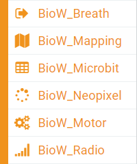
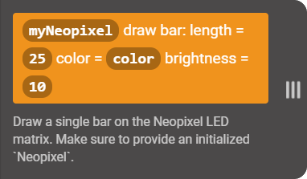
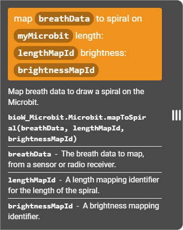
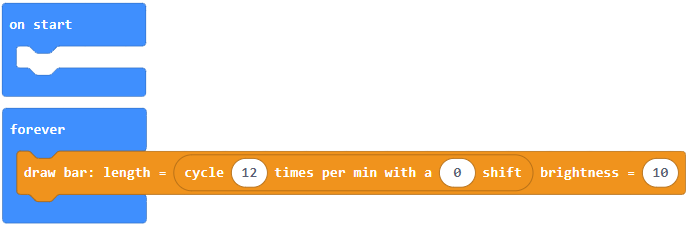
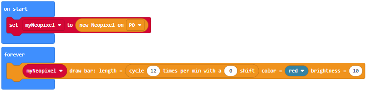
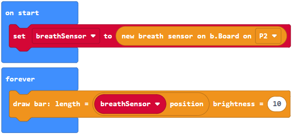
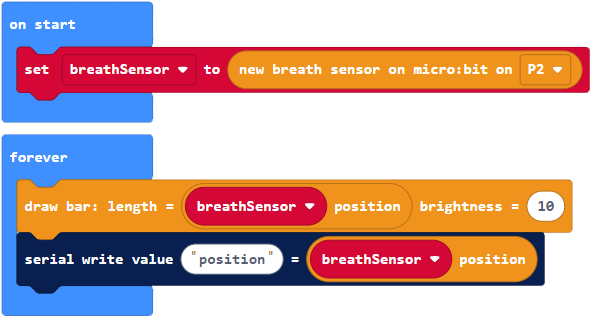
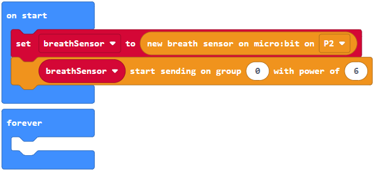
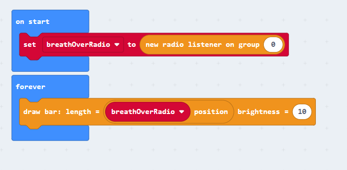

# Examples

[[_TOC_]]

----

### Setting up the library

You will need the biowearables library of custom blocks to run these examples in the IDE.

You can either:

- Import a hex file with the library to a new project: [biowearables_library.hex](../hex/biowearables_library.hex)
- Copy a `custom.js` file into an existing project: [custom.ts](../typescript/custom.ts)

You should see new tabs in the IDE for the custom blocks:

More information on using hex files and TypeScript files is available [here](../README.md/#storing-and-retrieving-projects).

----

### Using JavaScript mode for more information

While these examples focus on how things look in `|Blocks|` mode, additional information on all the blocks can be accessed by switching to `|JavaScript|` mode.

In the text editor, hovering over a function or variable brings up contextual information. And on the side, opening a tab with custom blocks displays summary information for each:

This information (generated from JSDoc style annotations in the source file) can be expanded by hovering over a block and clicking on the three vertical lines:

----

### BioW_Microbit: Drawing on the micro:bit

Source for main file: [main_microbit_example.ts](../typescript/main_microbit_example.ts)

Block program:

This tab includes drawing blocks for the 5x5 LED matrix on the micro:bit. Unlike the other components, there is no underlying class here. In terms of blocks, this means that there is no variable to first create in the `[on start]` block which remains empty.

We use `[cycle]` from the `|BioW_Breath|` tab to get a sinusoidal oscillator. It has a frequency of 12 cycles per minute, and a phase shift of 0.

The length of a `[draw bar]` block is set to this oscillating value. The bar is also set to a fixed brightness of `10`. This goes into the `[forever]` block.

You should see the oscillating bar in the simulator, or on an actual micro:bit if you flash it with this program.

----

### BioW_Neopixel: Drawing on the Neopixel

Source for main file: [main_neopixel_example.ts](../typescript/main_neopixel_example.ts)

Block program:

This tab includes blocks to create a Neopixel object and draw on the corresponding 8x8 LED matrix.

We first need to create an instance of the `neopixel.Strip` class and assign it to a variable. The first block in the `|BioW_Neopixel|` tab does just that. The default name for the variable is already set to `myNeopixel`. We also indicate which `pin` the Neopixel is connected to. Note that the creation block is placed in a `|Start block|` group to emphasize that its function is to create and initialize an object for later use. This goes in the `[on start]` block.

Just like for the micro:bit example, we use an oscillator. The length of a `[draw bar]` block is set to this oscillating value. The bar is also set to a fixed color of `red`, and a fixed brightness of `10`. All the Neopixel drawing blocks, grouped in the tab under `|Display|`, require a Neopixel object. This is already set by default to `myNeopixel` like the creation block. This goes into the `[forever]` block.

The library throws an error if the Neopixel object is missing or not initialized. Try dragging the `[set myNeopixel]` block out of the `[on start]` block for instance. An error will be thrown, indicated in the IDE by highlighting the block causing the problem:

And an error message popping up:

We ensure this way that a user is reminded to create objects before using them. Unfortunately, in `|Blocks|` mode the IDE displays the message only temporarily. It can take a few seconds to appear, and you can press `|Play|` or `|Restart|` to refresh the program and trigger the error.

----

### BioW_Breath: Connecting the breath sensor and getting data from it

Source for main file: [main_breath_sensor_example.ts](../typescript/main_breath_sensor_example.ts)

Block program:

This tab includes blocks to connect a breath sensor and get data from it.

We first need to create an instance of a `BreathSensor` object and assign it to a variable. The first blocks in the `|BioW_Breath|` tab do just that. We indicate which `pin` the sensor is connected to (on the micro:bit or the b.Board). This goes in the `[on start]` block.

Under the hood, creating `breathSensor` launches an independent forever loop that periodically polls the pin, stores the corresponding position, and calculates associated values such as the breath velocity. Running this separately rather than in the publicly exposed `[forever]` block, achieves a more reliable polling frequency, and avoid issues such as duplicate calls. All of this is transparent to the user.

When we need to get breathing data we simply use for instance a `[position]` block, assigned here to the length of a bar drawn on the micro:bit.

----

### Using Serial blocks to monitor actual data

Source for main file: [main_serial_example.ts](../typescript/main_serial_example.ts)

Block program:

----

### BioW_Radio: Sending and receiving breath data over radio

Source for sender main file: [main_radio_sender_example.ts](../typescript/main_radio_sender_example.ts)

Block program for sender:

Source for receiver main file: [main_radio_receiver_example.ts](../typescript/main_radio_receiver_example.ts)

Block program for receiver:

This tab includes blocks to send and receive breath data over radio.

----

### BioW_Mapping: Mapping inputs to outputs

