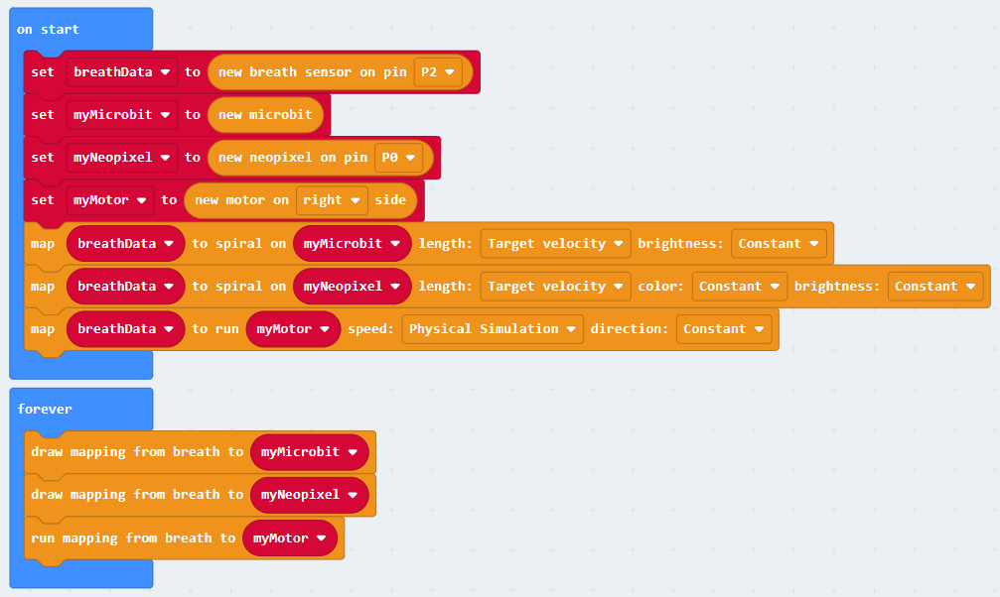
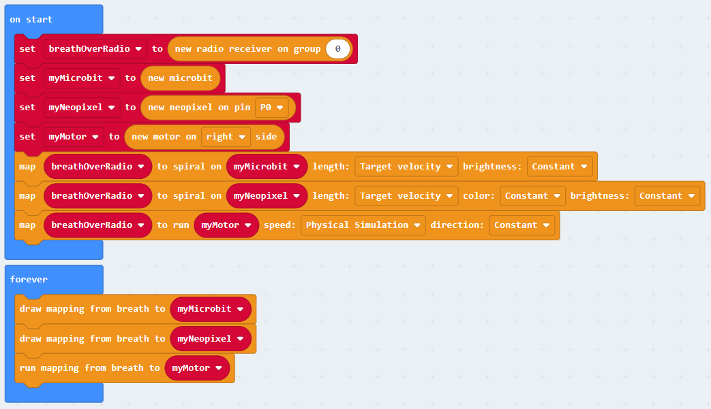
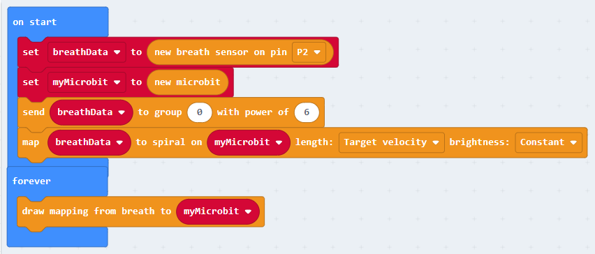

# Examples

[[_TOC_]]

----

### Everything connected to the b.Board

This would be for a b.Board connected to:

- a breath sensor
- a Neopixel
- a motor

In the `[on start]` block:

- Create an object for each component (breath sensor, micro:bit, Neopixel, motor).
- Set the mappings with dropdown menus for each parameter (micro:bit, Neopixel, motor).

In the `[forever]` loop:

- Draw and run the mappings.

----

### Receiver module

This would for a b.Board connected to:

- a Neopixel
- a motor

And with breath data received over radio from another micro:bit.

The program is almost completely similar to the previous one. The only difference is that instead of creating a `[new breath sensor]`, we create a `[new radio receiver]` in the `[on start]` block. The resulting object is then used just in the same way.

In the `[on start]` block:

- Create an object for each component (radio receiver, micro:bit, Neopixel, motor).
- Set the mappings with dropdown menus for each parameter (micro:bit, Neopixel, motor).

In the `[forever]` loop:

- Draw and run the mappings.

Note:

- The radio group set here has to match the radio group set in the sender.
- The default variable name is set to `breathOverRadio` to emphasize the different source. This implies switching the variable names in the mapping blocks. An alternative could be to use the same variable name `breathData` everywhere.

----

### Sender module

This would for a micro:bit connected to:

- a breath sensor

And with breath data sent over radio to another micro:bit.

Compared to what was done previously, we simply add a `[send]` block `[on start]` to start sending data over radio.

In the `[on start]` block:

- Create an object for each component (breath sensor, micro:bit).
- Start sending the breath data over radio.
- Set the mappings to the micro:bit.

In the `[forever]` loop:

- Draw the mappings.

Note:

- The radio group set here has to match the radio group set in the receiver.
