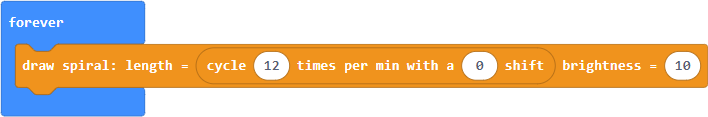
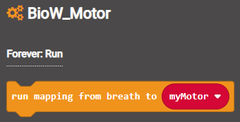

# Examples

### Content

- [Conventions](#conventions)
- [Example 1: Drawing directly on the micro:bit](#example-1-drawing-directly-on-the-microbit)
- [Example 2: Breath sensor and radio sender with display](#example-2-breath-sensor-and-radio-sender-with-display)
- [Example 3: Radio receiver with NeoPixel and motor](#example-3-radio-receiver-with-neopixel-and-motor)

----

### Conventions

We use the following conventions:

- `[BioW_Breath]`: A component of the IDE's interface, such as a tab or button.
- `||new neopixel||`: A block statement or expression.
- `length`: A parameter, piece of code, or file name.

----

### Example 1: Drawing directly on the micro:bit

#### Summary

This is a minimal example to draw an oscillating spiral on the micro:bit. Note that it relies on a direct drawing function that would generally not be used in the workshops, or only for testing purposes.

Source for main file: [main_01_draw_spiral.ts](../typescript/main_01_draw_spiral.ts)

----

#### Step 1

Look for the `||draw spiral||` block in the `[BioW_Microbit]` tab under `[... more]` (as the function is not meant for ordinary use).

Add the block to a `||forever||` loop. It has two parameters, `length` and `brightness`, which can be set to fixed values or functions that yield numeric values.

----

#### Step 2

To then draw an oscillating spiral look for the `||cycle||` block in the `[BioW_Breath]` tab under `[Utility]`. 

Assign the block to the `length` parameter of the spiral. The oscillator has itself two parameters, `frequency` and `phase shift`, which can be left to their default values.

Note that there is no underlying class here. In terms of blocks, this means that there is no variable to create, and no need for an `||on start||` block. You should see the oscillating spiral in the simulator, or on an actual micro:bit if you flash it with this program.

----

### Example 2: Breath sensor and radio sender with display

#### Summary

This example details a block program for a micro:bit that:

- is connected to a breath sensor,
- maps the measured data to a spiral on its LED matrix,
- and sends the corresponding breath data over radio.

Source for main file: [main_02_radio_sender.ts](../typescript/main_02_radio_sender.ts)

Complete program:

In summary, in the `[on start]` block:

- Create an object for each component (breath sensor and micro:bit).
- Set the mapping to draw on the micro:bit.
- Send the breath data over radio.

And in the `[forever]` loop:

- Draw the mapping.

----

#### Step 1

Create a new object for the breath sensor. Look for the `||new breath sensor||` block found in the `[BioW_Breath]` tab under `[On start: Create]`. Note that the name of the group indicates that the block is used to **create** an object for later use, and that it goes into the `||on start||` block.

Add the block to run `||on start||`. It has a default variable name already set to `breathData` which we can leave as is. Make sure to set the `pin` parameter to the pin to which the breath sensor is connected.

Under the hood, creating a `||new breath sensor||` launches an independent forever loop that periodically reads the pin, stores the corresponding position, and calculates associated values such as the breath velocity. Running this separately rather than in the publicly exposed `||forever||` loop achieves a more reliable sampling frequency, and avoid issues such as duplicate calculations. All of this is transparent to the user.

----

#### Step 2

Create a new object for the micro:bit. Look for the `||new microbit||` block found in `[BioW_Microbit]` under `[On start: Create]`.

Add the block to run `||on start||` (as indicated by the group name).

----

#### Step 3

Set a mapping from the breath sensor data to the micro:bit. There are a number of drawing patterns to choose from in `[BioW_Microbit]` under `[On start: Map]`. Let's choose `||map to spiral||`.

Add the block to run `||on start||`. Like the direct drawing function from [Example 1](#example-1-drawing-directly-on-the-microbit), the spiral pattern has two underlying parameters: `length` and `brightness`. But instead of setting numeric values we choose here a specific mapping for each parameter:

- Set `length` to `Target position` (which works without an actual breath sensor).
- Set `brightness` to `Constant low`.

Note that we can generally leave the default variable names already provided, such as `breathData`. Also, the library throws an error if we try using a variable without first creating it. For instance, calling `||map breathData||` with no previous `||set breathData||` results in:

We ensure this way that a user is reminded to create objects before using them.

----

#### Step 4

With the mapping now set, all we need to do is add a block to actually do the drawing in a `||forever||` loop. Look for the `||draw mapping||` block in `[Biow_Microbit]` under `[Forever: Draw]`.

Add the block to a `||forever||` loop to draw the chosen mapping.

Just like in [Example 1](#example-1-drawing-directly-on-the-microbit), you should now see the oscillating spiral in the simulator. But instead of drawing directly we first choose a mapping `||on start||` and then enact it in a `||forever||` loop.

----

#### Step 5

Finally, send the breath data over radio for another micro:bit to receive. Look for the `||send||` block in `[BioW_Radio]` under `[On start: Sender]`.

Add the block to run `||on start||`. The parameter values for the `group` and `power` can be left to their defaults.

----

### Example 3: Radio receiver with NeoPixel and motor

#### Summary

This example details a block program for a b.Board that:

- receives breath data over radio,
- maps this data to a spiral on the LED matrix of its micro:bit,
- to a connected NeoPixel LED matrix,
- and to a connected motor.

Source for main file: [main_03_radio_receiver.ts](../typescript/main_03_radio_receiver.ts)

Complete block program:

In summary, in the `[on start]` block:

- Create an object for each component (radio receiver, micro:bit, NeoPixel and motor).
- Set the mappings using the dropdown menus for all parameters.

And in the `[forever]` loop:

- Draw and run the mappings.

----

#### Step 1

Instead of measuring breath data from a breath sensor as in [Example 2](#example-2-breath-sensor-and-radio-sender-with-display), we are now listening for breath data over radio. Look for the `||new radio receiver||` block found in the `[BioW_Radio]` tab under `[On start: Receiver]`.

Add the block to run `||on start||`. Make sure that the `group` identifier is set to the same channel as what the sender is using. The `breathData` object that is created can then be used just as we used the object created for a breath sensor in [Example 2](#example-2-breath-sensor-and-radio-sender-with-display).

----

#### Step 2

Next we map the breath data to the micro:bit's LED matrix, using three blocks found in the `[BioW_Microbit]` tab.

- Create a `||new microbit||` object.

- Set the mapping with a `||map to spiral||` block.

- Enact the mapping with a `||draw mapping||` block.

Creating the object and setting the mapping is done `||on start||` (as indicated by the group names in the tab). Enacting the mapping is done in a `||forever||` loop. Choose `Target position` for the `length` parameter.

----

#### Step 3

Defining a mapping for the NeoPixel's LED matrix is similar, using three blocks found in the `[BioW_Neopixel]` tab.

- Create a `||new neopixel||` object `||on start||`.

- Set the mapping with a `||map to bar||` block `||on start||`. Choose `Target position` for the `length` parameter.

- Enact the mapping with a `||draw mapping||` block in a `||forever||` loop.

The block program is now:

----

#### Step 4

Finally, we define a mapping for the motor using three blocks found in the `[BioW_Motor]` tab.

- Create a `||new motor||` object `||on start||`.

- Set the mapping with a `||map to run||` block `||on start||`. Choose `Target position` for the `speed` parameter.

- Enact the mapping with a `||run mapping||` block in a `||forever||` loop.

The complete block program is:

