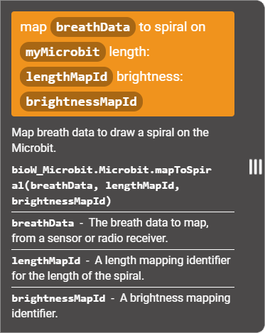

# BioWearables block library

### Content

- [Conventions](#conventions)
- [Setting up the library](#setting-up-the-library)
- [Overview](#overview)
- [Using JavaScript mode for more information](#using-javascript-mode-for-more-information)

----

### Conventions

We use the following conventions:

- `[BioW_Breath]`: A component of the IDE's interface, such as a tab or button.
- `||new neopixel||`: A block statement or expression.
- `length`: A parameter, piece of code, or file name.

----

### Setting up the library

You will need the biowearables library of custom blocks to run these examples in the IDE.

You can either:

- Import a hex file with the library to a new project: [biowearables_library.hex](../hex/biowearables_library.hex)
- Copy a `custom.ts` file into an existing project: [custom.ts](../typescript/custom.ts)

You should then see new tabs in the IDE for the custom blocks:

More information on using hex files and TypeScript files is available [here](./IDE_information.md/#storing-and-retrieving-projects).

----

### Overview

`[BioW_Microbit]` includes drawing blocks for the 5x5 LED matrix on the micro:bit.

----

### Using JavaScript mode for more information

While these examples focus on how things look in `[Blocks]` mode, additional information on all the blocks can be accessed by switching to `[JavaScript]` mode.

In the text editor, hovering over a function or variable brings up contextual information. And on the side, opening a tab with custom blocks displays summary information for each:

This information (generated from JSDoc style annotations in the source file) can be expanded by hovering over a block and clicking on the three vertical lines:

