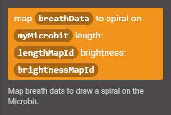

# Using the BioWearables library

### Content

- [Conventions](#conventions)
- [Setting up the library](#setting-up-the-library)
- [Overview](#overview)
- [Using JavaScript mode for more information](#using-javascript-mode-for-more-information)
- [Monitoring actual data in the console](#monitoring-actual-data-in-the-console)

----

### Conventions

We use the following conventions:

- `[BioW_Breath]`: A component of the IDE's interface, such as a tab or button.
- `||new neopixel||`: A block statement or expression.
- `length`: A parameter, piece of code, or file name.

----

### Setting up the library

You will need the BioWearables library of custom blocks to run these examples in the IDE.

You can either:

- Import a hex file with the library to a new project: [biowearables_library.hex](../hex/biowearables_library.hex)
- Copy a `custom.ts` file into an existing project: [custom.ts](../typescript/custom.ts)

You should then see new tabs in the IDE for the custom blocks:

More information on using hex files and TypeScript files is available [here](./IDE_information.md/#storing-and-retrieving-projects).

----

### Overview

`[BioW_Breath]`: To connect a breath sensor and get data from it.
`[BioW_Microbit]`: To draw on the micro:bit's 5x5 LED matrix.
`[BioW_NeoPixel]`: To connect a NeoPixel and draw on its 8x8 LED matrix.
`[BioW_Motor]`: To connect and run a motor.
`[BioW_Radio]`: To send and receive breath data over radio.

----

### Using JavaScript mode for more information

While these examples focus on how things look in `[Blocks]` mode, additional information on all the blocks can be accessed by switching to `[JavaScript]` mode.

In the text editor, hovering over a function or variable brings up contextual information. And on the side, opening a tab with custom blocks displays summary information for each:

This information (generated from JSDoc style annotations in the source file) can be expanded by hovering over a block and clicking on the three vertical lines:

----

### Monitoring actual data in the console

We can monitor actual data from a sensor by connecting the micro:bit over USB, and using blocks from the `[Serial]` tab. This can be useful for debugging or visualizing data.

Source for main file: [main_00_serial.ts](../typescript/main_00_serial.ts)

Block program:

Use a `||new breath sensor||` block to create a new object `||on start||` (from `[BioW_Breath]` / `[On start: Create]`).

Add a `||serial write value||` block in a `||forever||` loop (from `[Advanced]` / `[Serial]`).

Set the label to `position`, and the value to `breathData position` (from `[bioW_Breath]` / `[... more]`).

Once the program is running, an option to show the console appears:

If we are running the program in the simulator the choice is limited to a console showing simulated data. To work with sensors this is of limited use. But with the proper setup, and the program running on a micro:bit, we can also monitor actual data from the device:

This feature requires:

- running the IDE on **Chrome**
- a **paired** micro:bit
- connected over **USB**
- and with an up to date **firmware**.

More information on setting this up is available [here](./IDE_information.md#efficient-setup).
