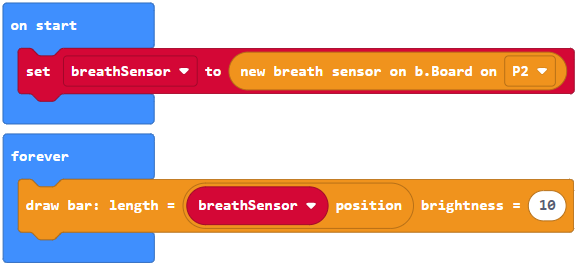
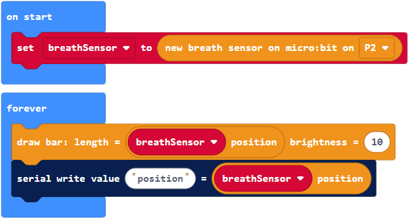
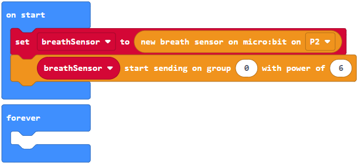
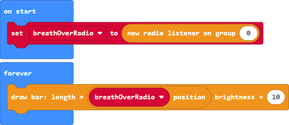

`[BioW_NeoPixel]` includes blocks to create a NeoPixel object and draw on the corresponding 8x8 LED matrix.

Source for main file: [main_example_neopixel.ts](../typescript/main_example_neopixel.ts)

Block program:

We first need to set a variable to a new NeoPixel object. The `||new neopixel||` block at the top of the `[BioW_NeoPixel]` tab does just that. Note that inside the tab it is grouped under `[Start block]` to emphasize that its function is to create and initialize an object for later use, and that it goes in the `||on start||` block.

All blocks have default values for their parameters, including variable names. In this case the default variable is `myNeoPixel`. You could leave it as is or change it. The only constraint is that variables are used consistently throughout the program. We also indicate which `pin` the NeoPixel is connected to.

Just like for the micro:bit example, we use an oscillator. The `length` of a `||draw bar||` block is set to this oscillating value. The bar is also set to a fixed `color`, and a fixed `brightness` of 10. All the NeoPixel drawing blocks, grouped in the tab under `[Display]`, require a NeoPixel object. This is already set by default to `myNeoPixel` as in the creation block. This goes into the `||forever||` loop.

The library throws an error if the NeoPixel object is missing or not initialized. Try dragging the `||set myNeoPixel||` block out of the `||on start||` block for instance. An error will be thrown, indicated in the IDE by highlighting the block causing the problem:

And an error message popping up:

We ensure this way that a user is reminded to create objects before using them. Unfortunately, in `[Blocks]` mode the IDE displays the message only temporarily. It can take a few seconds to appear, and you can press `[Play]` or `[Restart]` to refresh the program and trigger the error.

----

### BioW_Breath: Getting breath data from the sensor

`[BioW_Breath]` includes blocks to connect a breath sensor and get data from it.

Source for main file: [main_example_breath_sensor.ts](../typescript/main_example_breath_sensor.ts)

Block program:

We first need to set a variable to a `||new breath sensor||` block, found at the top of the `[BioW_Breath]` tab. We indicate which `pin` the sensor is connected to (on the micro:bit or on the b.Board). This goes in the `||on start||` block.

Under the hood, creating a `||new breath sensor||` launches an independent forever loop that periodically reads the pin, stores the corresponding position, and calculates associated values such as the breath velocity. Running this separately rather than in the publicly exposed `||forever||` loop achieves a more reliable sampling frequency, and avoid issues such as duplicate calculations. All of this is transparent to the user.

When we need to get breathing data we simply use for instance a `||position||` block, assigned here to the `length` of a bar drawn on the micro:bit.

----

### Serial: Monitor actual data in the console

`[Serial]` is a standard tab found under `[Advanced]` which we can use to monitor data in the console. This can be useful for debugging.

Source for main file: [main_example_serial.ts](../typescript/main_example_serial.ts)

Block program:

We can thus monitor the breath position in the previous program by adding a `||serial write value||` block in  the `||forever||` loop. It is set to post a label (any string) and a value set here to the breath `||position||`.

Once the program is running, an option to show the console appears:

If we are running the program in the simulator the choice is limited to a console showing simulated data. To work with sensors this is of limited use. But with the proper setup, and the program running on a micro:bit, we can also monitor actual data from the device:

This feature requires:

- running the IDE on **Chrome**
- a **paired** micro:bit
- connected over **USB**
- and with an up to date **firmware**.

More information on setting this up is available [here](../README.md).

----

### BioW_Radio: Sending breath data over radio

`[BioW_Radio]` includes blocks to send and receive breath data over radio. You will need two micro:bits to try this out.

Source for sender main file: [main_example_radio_sender.ts](../typescript/main_example_radio_sender.ts)

Block program for sender:

The **sender** should be connected to a breath sensor. As previously, we create a `||new breath sensor||` and indicate the `pin` to which it is connected. This is the same block found in the `[BioW_Breath]` tab.

We then start streaming the breath data from `breathSensor` by adding a `||start sending||` block. We also indicate the radio `group` and the output `power` to be used.

Both blocks go in the `||on start||` block.

----

### BioW_Radio: Receiving breath data over radio

This is a continuation of the previous section, and introduces the second program that runs on the **receiver** micro:bit.

Source for receiver main file: [main_example_radio_receiver.ts](../typescript/main_example_radio_receiver.ts)

Block program for receiver:

We create a `||new radio receiver||` in the `||on start||` block and set it to the variable `breathOverRadio`.

We can then get breath data from `breathOverRadio` using the same blocks that we used for a `BreathSensor`, found in the `[BioW_Breath]` tab: for instance, the breath `||position||`.

----

# Full examples

[[_TOC_]]

----

### Everything connected to the b.Board

This would be for a b.Board connected to:

- a breath sensor
- a NeoPixel
- a motor

In the `[on start]` block:

- Create an object for each component (breath sensor, micro:bit, NeoPixel, motor).
- Set the mappings with dropdown menus for each parameter (micro:bit, NeoPixel, motor).

In the `[forever]` loop:

- Draw and run the mappings.

----

### Receiver module

This would for a b.Board connected to:

- a NeoPixel
- a motor

And with breath data received over radio from another micro:bit.

The program is almost completely similar to the previous one. The only difference is that instead of creating a `[new breath sensor]`, we create a `[new radio receiver]` in the `[on start]` block. The resulting object is then used just in the same way.

In the `[on start]` block:

- Create an object for each component (radio receiver, micro:bit, NeoPixel, motor).
- Set the mappings with dropdown menus for each parameter (micro:bit, NeoPixel, motor).

In the `[forever]` loop:

- Draw and run the mappings.

Note:

- The radio group set here has to match the radio group set in the sender.
- The default variable name is set to `breathOverRadio` to emphasize the different source. This implies switching the variable names in the mapping blocks. An alternative could be to use the same variable name `breathData` everywhere.

----

### Sender module

This would for a micro:bit connected to:

- a breath sensor

And with breath data sent over radio to another micro:bit.

Compared to what was done previously, we simply add a `[send]` block `[on start]` to start sending data over radio.

In the `[on start]` block:

- Create an object for each component (breath sensor, micro:bit).
- Start sending the breath data over radio.
- Set the mappings to the micro:bit.

In the `[forever]` loop:

- Draw the mappings.

Note:

- The radio group set here has to match the radio group set in the receiver.
